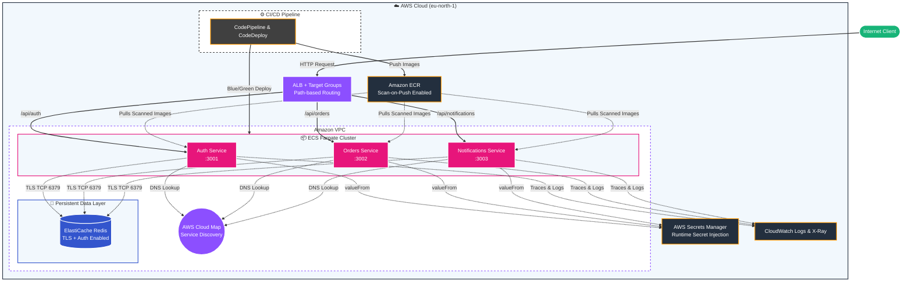

# AWS Microservices Architecture with ECS Fargate & ElastiCache

A production-grade, highly available microservices architecture built on AWS using Amazon ECS (Fargate), Amazon ElastiCache (Redis with TLS & Auth), Application Load Balancer (ALB), AWS Secrets Manager, Amazon ECR, AWS Cloud Map, and AWS CodePipeline / CodeDeploy.

---

## 🏗️ Architecture Diagram



---

## 📚 Complete Project Documentation

Detailed code snippets, architecture breakdowns, security posture explanations, root cause analysis, and step-by-step deployment instructions can be found in the comprehensive walkthrough document:

📖 **[Read the Full Documentation Walkthrough (`docs/WALKTHROUGH.md`)](docs/WALKTHROUGH.md)**

---

## 🛠️ Technology Stack & Rubric Compliance

- **ECS Fargate**: Task definitions, services, capacity providers with zero server management.
- **Amazon ECR**: Private container registry with image vulnerability scanning (`scan_on_push = true`) and tag immutability.
- **ALB + Target Groups**: Path-based HTTP routing to multiple microservices (`/api/auth`, `/api/orders`, `/api/notifications`).
- **AWS Cloud Map**: Private DNS service discovery (`project6.local`) for container-to-container resolution.
- **AWS Secrets Manager**: Runtime secret injection (`valueFrom`) for `REDIS_PASSWORD` and `JWT_SECRET`.
- **Amazon ElastiCache (Redis)**: Shared session and state store using Replication Group with Transit Encryption (TLS) and password auth.
- **AWS CodePipeline + CodeDeploy**: CI/CD pipeline with Blue/Green deployment controller and automatic rollback support.
- **AWS X-Ray & CloudWatch**: Centralized log streaming and IAM policies for distributed tracing.

---

## 🚀 Quick Start Deployment

1. **Deploy Infrastructure**:
   ```bash
   cd infrastructure/terraform
   terraform init
   terraform apply
   ```

2. **Push Containers & Deploy**:
   Build and push container images to Amazon ECR repositories generated by Terraform.

3. **Tear Down**:
   ```bash
   terraform destroy
   ```
