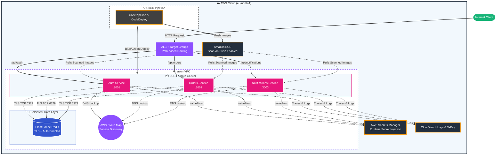

# AWS Microservices Capstone Project - Comprehensive Walkthrough & Architecture Guide

This document provides complete documentation for the AWS Microservices architecture, detailing every component, code snippet, implementation rationale, root cause analysis of infrastructure challenges, and step-by-step operational workflows.

---

## 1. System Architecture & Component Mapping



---

## 2. Core AWS Components & Rubric Specifications

| AWS Component | Why Needed | How Implemented |
| :--- | :--- | :--- |
| **ECS Fargate** | Serverless compute execution without managing EC2 instances. | Managed via `modules/ecs`. Tasks run in `awsvpc` network mode using task execution roles. |
| **Amazon ECR** | Private, secure Docker container registry. | Managed via `modules/ecr`. Enables tag immutability and `scan_on_push = true` for vulnerability checks. |
| **ALB + Target Groups** | Entry point routing traffic by HTTP request path. | Managed via `modules/alb`. Routes `/api/auth/*` to port 3001, `/api/orders/*` to 3002, `/api/notifications/*` to 3003. |
| **AWS Cloud Map** | Private DNS service discovery inside VPC. | Managed via `modules/cloudmap`. Creates `project6.local` private namespace so services resolve container endpoints dynamically. |
| **AWS Secrets Manager** | Secure storage and injection of sensitive credentials. | Managed via `modules/secrets`. Secrets are injected into containers at runtime via `valueFrom` Task Definition syntax. |
| **Amazon ElastiCache (Redis)** | High-speed shared session and state cache. | Managed via `modules/redis`. Uses Replication Group with Transit Encryption (TLS) and security group restriction. |
| **CodePipeline + CodeDeploy** | CI/CD automation and zero-downtime deployments. | Managed via `modules/codepipeline` and `modules/codedeploy`. Configures Blue/Green deployment controller on ECS services. |
| **AWS X-Ray & CloudWatch** | Observability, centralized logging, and distributed tracing. | Managed via `modules/monitoring` and `modules/iam`. Task roles include `xray:PutTraceSegments` and CloudWatch stream policies. |

---

## 3. Code Snippets & Implementation Deep Dives

### Snippet 1: Node.js Redis TLS & Secret Connection (`services/auth/src/services/redis_service.ts`)

```typescript
import Redis from 'ioredis';
import { config } from '../config/config';
import { logger } from '../config/logger';

const options: any = {
  host: config.REDIS_HOST,
  port: config.REDIS_PORT,
  maxRetriesPerRequest: 3,
  retryStrategy: (times: number) => Math.min(times * 200, 2000),
  name: 'auth_service'
};

// Enable TLS for AWS ElastiCache endpoints
if (config.REDIS_HOST.includes('amazonaws.com')) {
  options.tls = {};
}

// Inject password only if valid (ignore raw un-injected ARNs)
if (config.REDIS_PASSWORD && !config.REDIS_PASSWORD.startsWith('arn:aws:secretsmanager')) {
  options.password = config.REDIS_PASSWORD;
}

const redis_client = new Redis(options);

redis_client.on('connect', () => {
  logger.info({ redis_host: config.REDIS_HOST }, 'Connected to Redis');
});

redis_client.on('error', (err: Error) => {
  logger.error({ err: err.message }, 'Redis connection error');
});

export { redis_client };
```

#### Why We Needed This:
AWS ElastiCache with Transit Encryption requires SSL/TLS handshake over port 6379. Standard Redis clients without TLS options fail to establish handshakes.

#### How It Works:
1. Detects if `REDIS_HOST` contains `amazonaws.com`. If true, enables `options.tls = {}`.
2. Checks `config.REDIS_PASSWORD`. When Secrets Manager injects the password via `valueFrom`, it resolves to the actual plaintext secret string.

---

### Snippet 2: Terraform Secret Injection (`infrastructure/terraform/modules/ecs/main.tf`)

```hcl
resource "aws_ecs_task_definition" "services" {
  for_each                 = toset(var.service_names)
  family                   = "${var.project_name}_${each.key}"
  network_mode             = "awsvpc"
  requires_compatibilities = ["FARGATE"]
  cpu                      = var.task_cpu
  memory                   = var.task_memory
  execution_role_arn       = var.execution_role_arns[each.key]
  task_role_arn            = var.task_role_arns[each.key]

  container_definitions = jsonencode([
    {
      name      = each.key
      image     = "${var.ecr_repository_urls[each.key]}:latest"
      essential = true

      portMappings = [
        {
          containerPort = var.service_ports[each.key]
          hostPort      = var.service_ports[each.key]
          protocol      = "tcp"
        }
      ]

      environment = [
        { name = "PORT", value = tostring(var.service_ports[each.key]) },
        { name = "NODE_ENV", value = var.environment },
        { name = "SERVICE_NAME", value = each.key },
        { name = "REDIS_HOST", value = var.redis_host },
        { name = "REDIS_PORT", value = tostring(var.redis_port) }
      ]

      secrets = [
        {
          name      = "JWT_SECRET"
          valueFrom = var.secrets["jwt_secret"]
        },
        {
          name      = "REDIS_PASSWORD"
          valueFrom = var.secrets["redis_password"]
        }
      ]
    }
  ])
}
```

#### Why We Needed This:
Passing sensitive passwords in plain `environment` array (`value`) exposes secrets in plaintext in the ECS console and task definition JSONs.

#### How It Works:
Using `secrets` array with `valueFrom` forces the AWS ECS Agent during container initialization to make an IAM-authenticated call to Secrets Manager, fetch the secret string, and inject it as `process.env.REDIS_PASSWORD` inside the running container.

---

### Snippet 3: Security Group Cross-Referencing (`infrastructure/terraform/modules/security/main.tf`)

```hcl
resource "aws_security_group" "redis" {
  name        = "${var.project_name}_redis_sg"
  description = "Controls traffic to ElastiCache Redis. Only ECS tasks can connect."
  vpc_id      = var.vpc_id

  ingress {
    description     = "Redis port from ECS tasks only"
    from_port       = 6379
    to_port         = 6379
    protocol        = "tcp"
    security_groups = [aws_security_group.ecs.id]
  }

  egress {
    from_port   = 0
    to_port     = 0
    protocol    = "-1"
    cidr_blocks = ["0.0.0.0/0"]
  }
}
```

#### Why We Needed This:
In AWS VPC, Security Groups act as stateful firewalls. If Redis does not explicitly allow inbound TCP on port 6379 from the ECS Security Group ID, AWS silently drops all TCP SYN packets, producing a `connect ETIMEDOUT` error.

---

## 4. Root Cause Analysis of Resolved Issues

### Issue 1: `connect ETIMEDOUT` on Redis Connection
* **Root Cause**: The ECS Fargate service was either assigned the VPC `default` security group or the Redis Security Group (`project6_redis_sg`) lacked an ingress rule accepting traffic from `project6_ecs_sg`.
* **Permanent Fix**: Terraform modules now automatically reference `security_groups = [var.ecs_sg_id]` inside `aws_ecs_service` and `security_groups = [aws_security_group.ecs.id]` inside `aws_security_group.redis`.

### Issue 2: Plaintext ARN String Injected as Password
* **Root Cause**: In the Task Definition environment block, `REDIS_PASSWORD` was defined under `value` instead of `valueFrom`.
* **Permanent Fix**: `modules/ecs/main.tf` uses the `secrets` JSON block with `valueFrom` pointing directly to the Secret ARN.

---

## 5. Deployment Walkthrough Guide

### Step 1: Provision Infrastructure with Terraform
```bash
cd infrastructure/terraform
terraform init
terraform plan
terraform apply -auto-approve
```

### Step 2: Build and Push Microservice Images to ECR
```bash
# Login to ECR
aws ecr get-login-password --region eu-north-1 | docker login --username AWS --password-stdin <ACCOUNT_ID>.dkr.ecr.eu-north-1.amazonaws.com

# Build & Push Auth Service
docker build -t project6_auth ./services/auth
docker tag project6_auth:latest <ACCOUNT_ID>.dkr.ecr.eu-north-1.amazonaws.com/project6_auth:latest
docker push <ACCOUNT_ID>.dkr.ecr.eu-north-1.amazonaws.com/project6_auth:latest

# Build & Push Orders Service
docker build -t project6_orders ./services/orders
docker tag project6_orders:latest <ACCOUNT_ID>.dkr.ecr.eu-north-1.amazonaws.com/project6_orders:latest
docker push <ACCOUNT_ID>.dkr.ecr.eu-north-1.amazonaws.com/project6_orders:latest

# Build & Push Notifications Service
docker build -t project6_notifications ./services/notifications
docker tag project6_notifications:latest <ACCOUNT_ID>.dkr.ecr.eu-north-1.amazonaws.com/project6_notifications:latest
docker push <ACCOUNT_ID>.dkr.ecr.eu-north-1.amazonaws.com/project6_notifications:latest
```

### Step 3: Test API Endpoints
```bash
curl -X POST http://<ALB_DNS_NAME>/api/auth/register \
  -H "Content-Type: application/json" \
  -d '{"email":"user@example.com","password":"password123"}'
```

### Step 4: Destroy Infrastructure when Finished
```bash
cd infrastructure/terraform
terraform destroy -auto-approve
```
